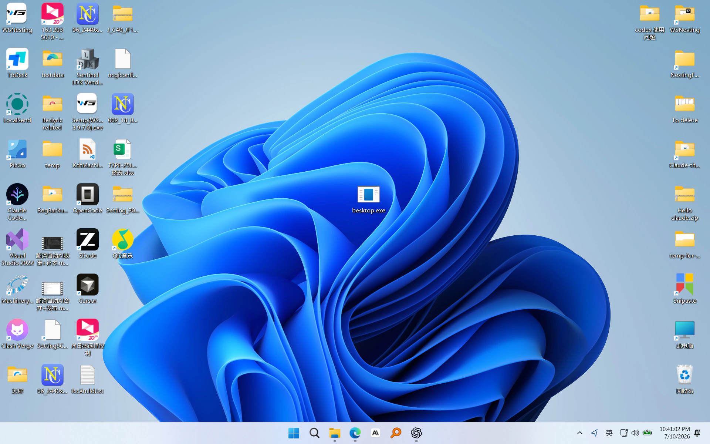

<p align="center">
  
</p>

# Besktop

> 我的电脑“中毒”了：桌面图标开始打架。
> 不是病毒，不删文件，只是一个让桌面图标开打的 Windows 桌面整活工具。

Besktop 的首个玩法叫 **Icon Fight**：它会把你的桌面临时变成一个安全的全屏舞台，让空间分散的首批桌面图标先醒来探索，随后通过第二批、邻近加速和兜底波次让全部图标陆续长出白色手脚并自由闲逛。第一轮单演员基础动作库已经完成；普通 Release 会在纯漫游开场后，偶尔让一对自然靠近的演员注意到彼此、接近并短暂判断，再进入攻防、退让或虚张声势，最后带着不同结果余波回到闲逛。

## 运行效果

<table>
  <tr>
    <th width="50%">启动前：原始桌面</th>
    <th width="50%">启动后：图标全部醒来</th>
  </tr>
  <tr>
    <td></td>
    <td></td>
  </tr>
</table>

所有动画都发生在 Besktop 重建的全屏舞台中；退出后，真实桌面仍保持原样。

舞台会在全屏窗口出现前一次性捕获主显示器任务栏，并把静态画面绘回原位置；它不是可交互的任务栏，也不会持续刷新时钟或托盘状态。图标漫游使用系统报告的工作区域避开任务栏。当前重点验证主显示器与 Windows 默认 Shell，尚不承诺完整多显示器和第三方 Shell 兼容性。

目标很简单：录屏 5 秒，朋友看完问一句：

```text
这个在哪下载？
```

当前阶段：**v0.1.0 RC**。桌面舞台、真实图标采集、图标演员、基础动作和安全退出已经落地，正在完成首个公开下载候选版本的兼容性与发布验收，尚未正式发布。

## 它会发生什么？

计划中的第一版体验：

1. 双击运行 `Besktop.exe`。
2. 当前桌面看起来一切正常。
3. 全部图标保持真实原位，桌面先短暂停顿，再由空间分散的第一批图标开始觉醒。
4. 第一批开始探索后，第二批和兜底批次继续错峰醒来；活跃演员经过沉睡图标附近时，会让后者稍早醒来。
5. 每个图标仍在自己的真实原位长出简洁的白色手脚，再进入桌面安全区域自由闲逛。
6. 第一批生态就绪后再保留约 6 秒纯探索，随后局部演员可能并行发生相遇；每场仍只有两名演员，可能攻防、退让或虚张声势，其他演员继续闲逛或完成觉醒。
7. 按 `P` 可以在“自动互动”和“仅自由漫游”之间切换；该选择只对本次运行有效。
8. 按 `Esc` 退出，真实桌面恢复原样。

## 为什么有趣？

因为它把很严肃、很日常的 Windows 桌面变成了一个突然失控的小剧场。

不是两个陌生角色在打架，而是你的浏览器、聊天软件、游戏、文件夹、快捷方式突然活了。第一眼像电脑出事了，第二眼发现它只是太会整活。

Besktop 想抓住的就是这种反差：

```text
哪有这种病毒啊哈哈哈哈。
```

## 安全边界

Besktop 不是真病毒。

- 不删除文件。
- 不移动真实桌面图标。
- 不修改 Explorer。
- 不做自动开机启动。
- 不后台驻留。
- 不提权。
- 按 `Esc` 退出。

动画发生在 Besktop 自己重建的安全桌面舞台中。真实桌面始终留在下面，不被修改。

## 首个玩法：Icon Fight

Icon Fight 的目标不是做复杂游戏，而是做一个“看一眼就想转发”的桌面小惊喜。

计划中的基础效果：

- 图标文字先出现异常。
- 图标长出简洁的白色手脚。
- 图标本体像一张双面小薄片一样翻转、侧身和摆动，左转右转都能认出原来的图标。
- 白色手脚像长在图标薄片外侧的小骨架，而不是贴在图标表面的线条。
- 动作系统先打磨走路、转身、脚落地和手脚反相摆动，再扩展拳击、侧踢、闪避和受击。
- 角色之间可以靠近、出拳、转身侧踢、闪避、受击和恢复。
- 被攻击的图标也会加入打架，形成逐步扩散的桌面群架。
- 动作轻量、夸张、短循环，适合录屏传播。

## 当前状态

本仓库目前已经完成：

- 项目定位、开源边界和商业边界文档。
- Windows 原生技术路线。
- 感染演出模式实施计划。
- 最小玩法包加载 MVP。

当前已用固定双演员诊断预览接通靠近、对齐、共享时间线、真实 Contact 几何与结果反馈；普通 Release 已接入个体驱动的首版相遇基础。`ActiveEncounterPool` 会消费仲裁结果中的全部安全请求，使多个互不冲突的局部相遇独立运行；没有固定活动对数上限，实际并发仅由双方握手、演员占用和空间条件决定，也不会开启全量群架。

## 技术方向

初步推荐技术栈：

- C++20
- Win32
- Direct3D 11
- Direct2D / DirectWrite
- Windows Imaging Component
- CMake + Visual Studio 2022

## 调试开关

Debug 构建默认允许开发者通过环境变量开启诊断能力：

```powershell
$env:BESKTOP_FRAME_STATS='1'      # 每秒记录帧率、总绘制耗时和各渲染阶段平均耗时
$env:BESKTOP_FRAME_TRACE='1'      # 记录首帧和壁纸缓存的分段 trace
$env:BESKTOP_ANIMATION_SPEED='0.5' # 0.5 倍速慢放观察动作，默认 1.0
$env:BESKTOP_ANIMATION_OFFSET='4.5' # 从动画第 4.5 秒开始，便于直接观察某个动作阶段
$env:BESKTOP_DEBUG_ICON_PLANE='1'   # 显示图标薄片调试边框
$env:BESKTOP_RENDER_SHADOWS='1'     # 显示开发期阴影效果
$env:BESKTOP_MAX_ACTORS='10'        # 仅创建前 10 个演员；未设置或设为 0 时全部觉醒
$env:BESKTOP_ACTION_PREVIEW='lead_straight' # 首演员原地循环预览动作
$env:BESKTOP_ACTION_ORBIT_CAMERA='1' # 摄像头绕动作预览演员的身体中轴连续观察
$env:BESKTOP_TURN_PREVIEW='1'       # 首演员原地循环预览连续 3D 转身
$env:BESKTOP_COMBAT_PREVIEW='lead_parry' # 前两个演员运行固定攻防场景
$env:BESKTOP_COMBAT_DIRECTOR_PREVIEW='1' # 显式启用导演诊断观测与汇总日志
```

第一轮单演员动作库支持以下预览 ID：

```text
lead_straight  rear_straight  uppercut  hook  swing_punch
layback  slip_left  slip_right  parry
front_kick  side_kick  roundhouse_kick  spinning_back_kick
light_hit_react  heavy_stagger  whiff_recovery
```

单动作预览会等待首个演员完成觉醒和四肢生长，再暂停该演员的随机漫游并循环播放；推荐配合 `BESKTOP_MAX_ACTORS=1` 和 `BESKTOP_ANIMATION_SPEED=0.5` 观察。`BESKTOP_TURN_PREVIEW=1` 使用同一诊断约定循环展示左右连续转身。

固定双演员预览支持 `lead_parry`、`lead_slip`、`uppercut_light_hit`、`side_kick_heavy_hit`。推荐设置 `BESKTOP_MAX_ACTORS=2`；双方觉醒后会平滑走到工作区中央附近、连续转身面对彼此、稳定站立，再按共享时间线完成交互并平滑回到站位循环。Contact 使用实际拳端或脚端和防守者身体轴胶囊判定；防守窗口不会绕过几何条件。固定 Combat、Turn 和 Action 预览会按该顺序优先接管场景，并暂停产品 `ActiveEncounterPool`。未设置固定预览时，普通 Release 默认运行全量觉醒、自由漫游和低频生态相遇，也没有生命值、胜负或全量群架。

觉醒计划由独立 `AwakeningDirector` 在舞台初始化时一次性生成：约 `20%` 的演员作为空间分散的第一批，在约 `2–9` 秒缓慢启动；约 `35%` 作为第二批，在约 `12–26` 秒启动；其余演员在约 `30–52` 秒兜底醒来。已完成四肢生长并进入探索的演员，会在约 `2.7` 个图标边长范围内，以稳定的 `4–7` 秒因果等待提前附近沉睡演员的计划时间。睡眠演员保持静止，只有进入自身觉醒过程的演员才会震动；该规则让相邻扩散保持可辨认的缓慢节奏，不把后续批次瞬间压成同一波，也不依赖名称、路径或墙钟随机数，不会改变漫游随机序列。

产品 Director 不再等待所有演员觉醒；当第一批全部完成四肢生长且至少有两名正常 Wanderer 后，才开始既有约 `6` 秒纯探索缓冲。每个演员只根据稳定种子获得 `Bold`、`Timid`、`Curious`、`Calm` 或 `Energetic` 之一，不读取应用名称、路径、品牌或文件内容；警觉、兴奋、体力、最近对象和个体冷却只保存在本次运行内。演员仅感知附近自然接近、朝向合适且有安全空间的对象，并在约 `0.35–0.8` 秒内保持 `Ignore`、`Avoid`、`Observe`、`Approach`、`Challenge`、`Respond` 或 `Yield` 意图。只有双方意图兼容时才提交相遇请求，例如 Challenge + Respond、Challenge + Yield、Approach + Observe 或双方 Approach；单方面 Challenge 遇到明确 Avoid 不会被强制拉进战斗。

独立 `EncounterArbiter` 只检查演员占用、工作区、任务栏安全区域和 reservation 冲突，不负责随机点名，也没有固定活动对数上限；一次仲裁可以接受零个、一个或多个互不冲突请求。`ActiveEncounterPool` 为每个接受结果保存稳定 ID、双方索引、reservation、独立 `EncounterDirector` 与 `CombatPair`，逐场更新和释放；非参与演员会避开全部活动 reservation。命中、重击、拨挡、闪避和打空仍使用既有 `CombatPair`；非战斗分支不启动攻击动作、Contact 或命中特效。下一阶段才扩展约 `8–16` 秒、`3–7` 次交换的完整交锋段。按 `P` 关闭后立即停止新请求，已开始的所有相遇分别自然完成并释放；重新开启仍先经过漫游缓冲。

动作预览时可再设置 `BESKTOP_ACTION_ORBIT_CAMERA=1`：诊断摄像头会围绕角色身体中轴连续环绕，8 个动画秒完成一圈，用于从正面、侧面和背面检查薄片、挂点与固定骨长四肢。该观察变换不改变动作数据、逻辑朝向或漫游转身状态；在 `0.5x` 动画速度下，一圈约需 16 秒。

普通 Release 构建会忽略上述诊断单项变量，并固定使用 `1.0x` 动画速度和 `0` 秒偏移，但产品 Director 默认开启。需要显式诊断 Director 或使用固定预览时，必须先设置总开关，再设置所需单项：

```powershell
$env:BESKTOP_ENABLE_DIAGNOSTICS='1'
$env:BESKTOP_COMBAT_DIRECTOR_PREVIEW='1'
```

Debug 或已启用诊断的 Release 会记录详细 Info 日志；普通 Release 默认只记录 Warning/Error，且不会仅因正常启动创建日志。这些开关只用于调试，不改变真实桌面，不属于用户可见玩法设置。

关键文档：

- 技术方案：[docs/TECHNICAL_PLAN.md](docs/TECHNICAL_PLAN.md)
- 实施计划：[docs/IMPLEMENTATION_PLAN.md](docs/IMPLEMENTATION_PLAN.md)
- 渲染性能基线与回归规范：[docs/RENDER_PERFORMANCE.md](docs/RENDER_PERFORMANCE.md)
- 格斗动作候选库：[docs/FIGHT_ACTION_CATALOG.md](docs/FIGHT_ACTION_CATALOG.md)
- 第一轮动作系统实施计划：[docs/FIGHT_ACTION_IMPLEMENTATION.md](docs/FIGHT_ACTION_IMPLEMENTATION.md)
- 仓库定位和发布模型：[docs/REPOSITORY_AND_RELEASE_MODEL.md](docs/REPOSITORY_AND_RELEASE_MODEL.md)
- Core 单 EXE 发布构建：[docs/RELEASE.md](docs/RELEASE.md)
- v0.1.0 发布说明候选稿：[docs/RELEASE_NOTES_v0.1.0.md](docs/RELEASE_NOTES_v0.1.0.md)
- v0.1.0 发布候选验收清单：[docs/RELEASE_CHECKLIST.md](docs/RELEASE_CHECKLIST.md)
- 插件框架 MVP：[docs/MVP_PLUGIN_FRAMEWORK.md](docs/MVP_PLUGIN_FRAMEWORK.md)

## 仓库关系

```text
Besktop
  开源核心仓库，GPL-3.0。
  负责主程序、基础引擎、免费玩法、公开文档和通用扩展接口。

Besktop-Plus
  私有商业仓库。
  负责付费玩法内容、支付授权、商业发布编排和私有资源。
```

用户层面的发布主体始终是 **Besktop**。第一版优先追求“一个 `Besktop.exe` 下载后即可运行”的传播形态。

## 当前不做什么

- 不接入真实支付。
- 不实现授权系统。
- 不发布第二个 Plus 软件。
- 不做自动开机启动。
- 不修改或移动真实桌面文件。
- 不引入大型游戏引擎。
- 暂不接受代码 PR。

## 开源与商业边界

Besktop Core 采用 GPL-3.0。作者保留将自己编写的核心代码用于 Besktop Plus 商业分发的权利。

早期不接受代码贡献，主要原因是项目未来可能需要双授权和清晰版权边界。欢迎 issue、使用反馈、动作创意、命名建议和兼容性报告。

详细边界见 [docs/OPEN_CORE_BOUNDARY.md](docs/OPEN_CORE_BOUNDARY.md)。
